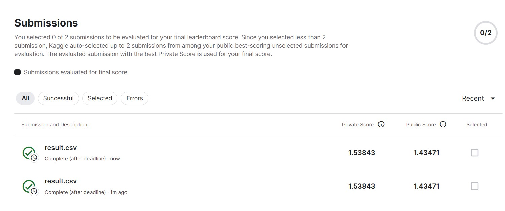

# 实验一 新冠阳性检出率预测

实验一过程在jupyter文件里已经详细讲述，在kaggle上的运行结果为1.43。

在实验中一个值得注意的点是，用sigmoid作为激活函数的模型在训练中很难收敛，但是用relu作为激活函数的模型会很快收敛。经过查阅资料，relu比sigmoid更容易收敛的原因是，在x是正数的部分，relu的梯度都是线性函数的斜率k，而sigmoid函数在x较大的情况下梯度极其接近于0。也就是说，在这种情况下，sigmoid函数不会出现太大的数值变化，所以relu的训练会比sigmoid更快。基于此，在x是负数的部分，relu和sigmoid函数又都有梯度消失的问题。
